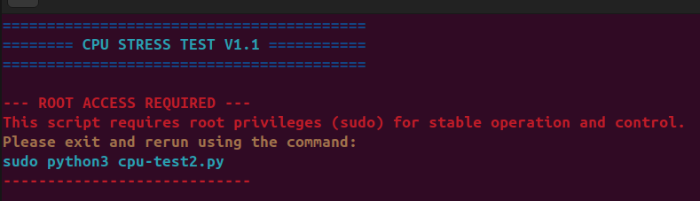
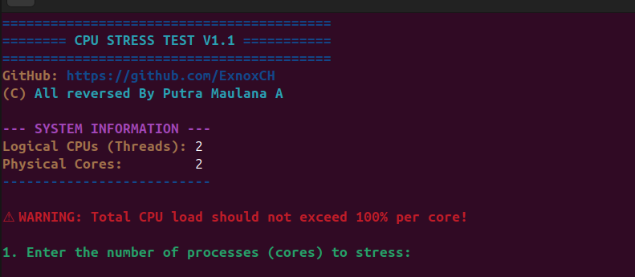

# CPU-Stress-Test
## 1.What is `CPU Stress Test?`
`CPU Stress Test` is a program to test your CPU or stress your CPU.

## How does it work?
CPU Stress Test works by duplicating itself

### THIS TEST REQUIRES `ROOT ACCESS!`

# REQUIRED
### Install the virtual environment first
```bash
python -m venv venv
```
and
```bash
source venv/bin/activate
```
Psutil command (bash)
```bash
pip install psutil
```

# PREVIEW


